# Jarkom-Modul-2-2026-K-34

# Member
--- 

| NO  |             Nama              |    NRP     |
| :-: | :---------------------------: | :--------: |
|  1  | Muhammad Syadzili Abdul Muhyi | 5027251030 |
|  2  | Bambang Nasarillah Kurniawan  | 5027251110 |

# Laporan
---
##### 1. Sebagai pusat kesadaran The Mesh, rootkit harus merentangkan koneksinya ke lima gerbang utama (Switch). Tetapkan alamat IP dan default gateway untuk seluruh Entitas, mulai dari para operator (alpha, beta, gamma), penjaga directory (prab, tedd), gerbang penyaring (abbey, penny), hingga repository (obladi, desmond, oblada, molly) sesuai dengan topologi pembagian switch yang dirancang. [GUNAKAN PREFIX IP MASING-MASING KELOMPOK].


Disini kami membuat topologi jaringan sesuai dengan yang diminta oleh soal, yaitu dengan menggunakan beberapa konfigurasi berikut:

- **NAT** : digunakan sebagai gateway untuk mendapatkan akses internet dan memberikan koneksi jaringan eksternal.
- **Router Eru** : digunakan sebagai router utama yang menghubungkan jaringan NAT dengan seluruh jaringan internal.
- **Switch 1** : digunakan sebagai penghubung antara Router Eru dengan jaringan **Prab, Tedd, dan jaringan bawah**.
- **Switch 2** : digunakan sebagai penghubung antara jaringan **Prab/Tedd** dengan **Obladi, Oblada, dan Desmond**.
- **Switch 3** : digunakan sebagai penghubung antara Router Eru dengan jaringan **Penny, Molly, dan Epsilon**.
- **Switch 4** : digunakan sebagai penghubung antara Router Eru dengan **Abbey**.
- **Switch 5** : digunakan sebagai penghubung antara Router Eru dengan **Penny dan Molly**.
- **Switch 6** : digunakan sebagai penghubung antara Router Eru dengan **Alpha, Beta, dan Gamma**.
- **Alpha, Beta, Gamma** : merupakan client pada jaringan bagian atas dengan alamat jaringan **192.228.20.x**.
- **Delta, Epsilon** : merupakan client pada jaringan sebelah kanan dengan alamat jaringan **192.228.30.x**.
- **Abbey** : merupakan client pada jaringan **192.228.40.x**.
- **Penny, Molly** : merupakan client pada jaringan **192.228.50.x**.
- **Prab, Tedd** : merupakan server pada jaringan **192.228.10.x**.
- **Obladi, Oblada, Desmond** : merupakan client/server pada jaringan **192.228.10.x** bagian bawah.

##### 2. Meskipun The Mesh beroperasi dalam bayang-bayang, Rootkit menyadari bahwa Entitas di dalamnya masih membutuhkan asupan paket dari dunia luar. Buka jalur menuju NAT dengan memastikan antarmuka WAN di router rootkit aktif. Konfigurasikan NAT agar dapat meneruskan lalu lintas keluar bagi seluruh alamat internal, sehingga semua host di dalam jaringan dapat menjangkau internet publik menggunakan IP address.

Di sini kita membuat script yang bernama `power.sh` yang dimana dia digunakan untuk mengonfigurasi node Rootkit sebagai router utama, mulai dari mengatur IP pada interface eth1–eth5, mengaktifkan IP forwarding, melakukan NAT agar jaringan internal dapat mengakses internet, mengatur forwarding menggunakan iptables, serta memasang dan mengonfigurasi DHCP Server untuk membagikan IP otomatis pada jaringan 192.228.10.0/24 sampai 192.228.50.0/24. Di akhir, script juga melakukan pengecekan konfigurasi DHCP dan menampilkan status interface, IP forwarding, serta DHCP Server.

Mari kita cek menggunakan client alpha ngeping ke google dan ke host beta dengan ip seperti dibawah


##### 3. Jaringan rahasia tidak akan berfungsi tanpa sinkronisasi antar divisi. Pastikan seluruh Entitas dapat saling terhubung dan berkomunikasi lintas jalur (routing internal via rootkit berfungsi). Untuk menghindari fragmentasi saat persiapan, pastikan setiap host non-router menambahkan resolver 192.168.122.1 (tambah di file /etc/resolv.conf, kalau sudah pakai resolver itu tidak perlu memasukkan resolver google) saat antarmukanya aktif agar akses untuk mengunduh paket instalasi dari internet tersedia sejak awal beroperasi.

Jadi kita terlebih dahulu melakukan pengecekan apakah ada name server default yang dimiliki client cara untuk mengeceknya adalah dengan command
```
cat /etc/resolv.conf
```
Jika tidak ada maka kita memasukkan dengan command line seperti ini 
```
echo "nameserver 192.168.122.1" > /etc/resolv.conf
```
tapi dalam kasus kita yang dimana ketika node mati maka hilang jadi kita akan menaruhnya di configuration seperti contoh pada client abe ini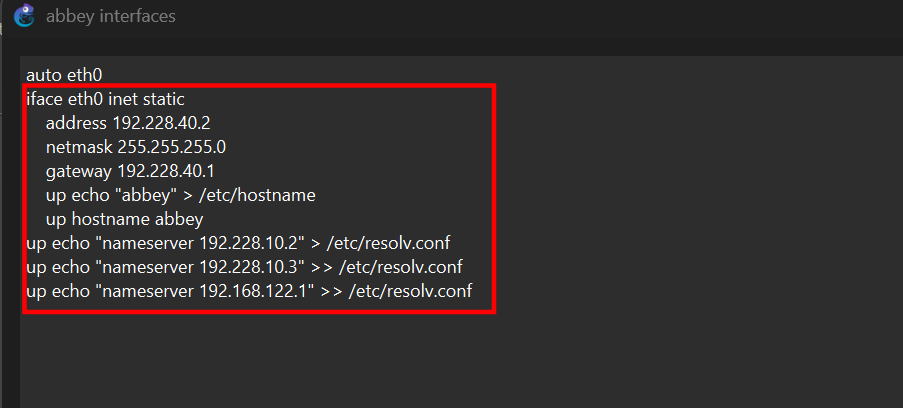

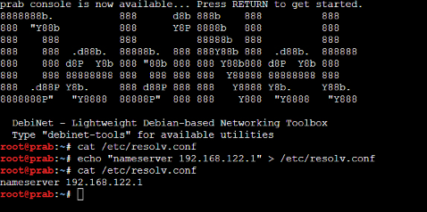

#####  4. Penjaga Direktori mulai menuliskan hukum The Mesh. Pada node prab, bangun zona <xxxx>.com sebagai authoritative dengan SOA yang menunjuk ke prab.<xxxx>.com, serta tambahkan catatan NS untuk prab.<xxxx>.com dan tedd.<xxxx>.com. Buat A record untuk prab.<xxxx>.com dan tedd.<xxxx>.com yang mengarah ke alamat IP mereka masing-masing, serta A record apex <xxxx>.com yang mengarah ke gerbang aplikasi dinamis (penny). Aktifkan fitur notify dan allow-transfer ke tedd, lalu set forwarders ke 192.168.122.1. Di node tedd, tarik zona <xxxx>.com dari master dan pastikan server menjawab secara authoritative. Setelah fondasi nama ini berdiri kokoh, perbarui urutan resolver pada seluruh Entitas non-router menjadi: IP prab, IP tedd, lalu 192.168.122.1. Verifikasi bahwa query ke domain apex maupun hostname di dalam zona dijawab dengan benar oleh prab atau tedd. 


mengarah ke gerbang aplikasi dinamis (penny). Aktifkan fitur notify dan allow-transfer ke tedd, lalu set forwarders ke 192.168.122.1. Di node tedd, tarik zona xxxx.com dari master dan pastikan server menjawab secara authoritative. Setelah fondasi nama ini berdiri kokoh, perbarui urutan resolver pada seluruh Entitas non-router menjadi: IP prab, IP tedd, lalu 192.168.122.1. Verifikasi bahwa query ke domain apex maupun hostname di dalam zona dijawab dengan benar oleh prab atau tedd. 
Berdasarkan konfigurasi yang telah dibuat (master.sh) pada node prab, DNS Master untuk zona K34.com telah dikonfigurasi menggunakan BIND9. Konfigurasi tersebut menetapkan prab sebagai authoritative DNS Master, dengan prab.K34.com sebagai SOA, serta mendefinisikan prab.K34.com dan tedd.K34.com sebagai Name Server (NS). Selain itu, telah dibuat A record untuk prab.K34.com menuju 192.228.10.2, tedd.K34.com menuju 192.228.10.3, dan domain utama K34.com menuju 192.228.50.2 yang merupakan alamat IP penny. Konfigurasi juga mengaktifkan mekanisme notify dan allow-transfer kepada tedd (192.228.10.3) serta menggunakan 192.168.122.1 sebagai forwarder. Setelah konfigurasi dibuat, validasi menggunakan named-checkzone menghasilkan status OK, sedangkan pengujian menggunakan dig menunjukkan bahwa K34.com dan prab.K34.com berhasil memberikan alamat IP yang sesuai dengan flag aa (Authoritative Answer). Dengan demikian, konfigurasi DNS Master pada prab telah berjalan sesuai dengan kebutuhan zona K34.com.


Setelah DNS Master pada prab berhasil dikonfigurasi, tahap selanjutnya adalah mengatur tedd sebagai DNS Slave untuk zona K34.com. Konfigurasi ini bertujuan agar tedd dapat mengambil dan menyimpan salinan zona dari DNS Master prab melalui zone transfer, kemudian memberikan jawaban DNS secara authoritative untuk zona tersebut. Dengan demikian, tedd dapat berfungsi sebagai DNS cadangan apabila DNS Master prab mengalami gangguan. Konfigurasi DNS Slave pada modul juga menggunakan type slave dengan masters yang mengarah ke server DNS Master, kemudian dilakukan pengujian untuk memastikan DNS tetap dapat digunakan ketika Master tidak tersedia
.
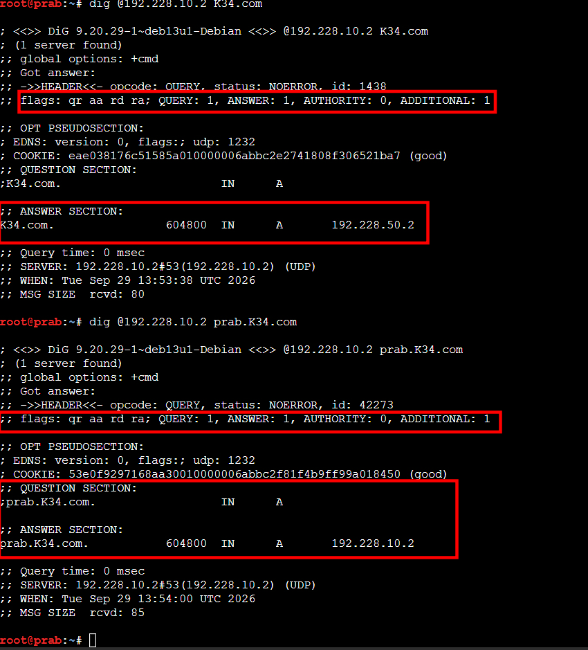

Pengujian host name:
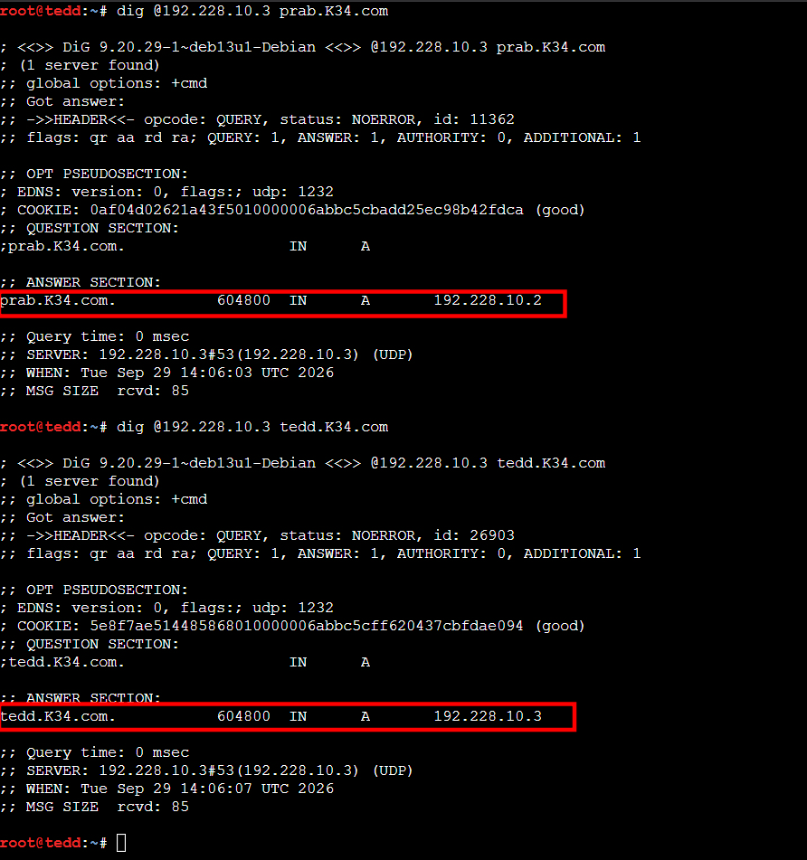

Uji dari client ke server:
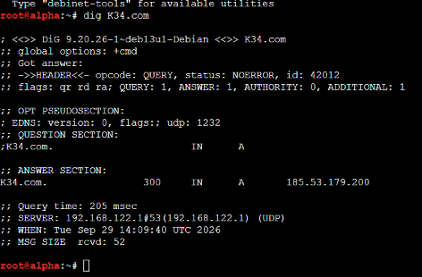


Client berhasil melakukan DNS query menggunakan dig K34.com tanpa menentukan IP DNS server secara langsung. Query diteruskan kepada DNS resolver yang terdaftar pada konfigurasi resolver client, yaitu 192.168.122.1, dan berhasil memperoleh alamat IP untuk domain K34.com.


Pengetesan jika prab mati maka tedd bakal menjadi DNS cadangan
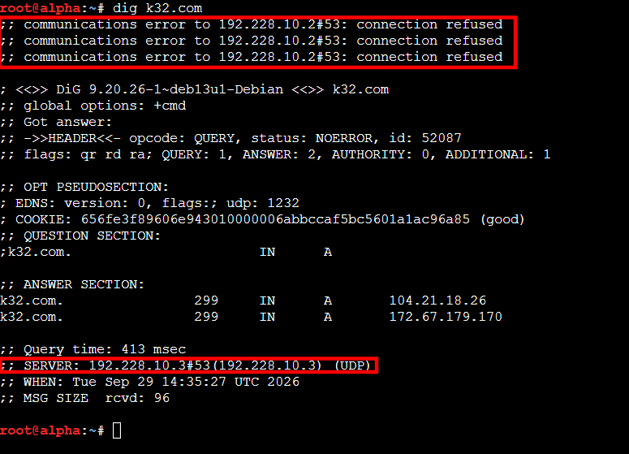


##### 5. "Entitas tanpa identitas adalah anomali," pesan Rootkit. Namai semua Entitas (hostname) sesuai glosarium: rootkit, alpha, beta, gamma, delta, epsilon, prab, tedd, abbey, penny, obladi, desmond, oblada, molly, dan verifikasi bahwa setiap host mengenali hostname tersebut secara system-wide. Buat setiap domain untuk masing-masing node sesuai dengan namanya (contoh: alpha.<xxxx>.com) dan assign IP masing-masing juga. Lakukan pengecualian untuk node yang bertanggung jawab atas prab dan tedd.

Kita melakukan config di configuration clien terlebih dahulu 
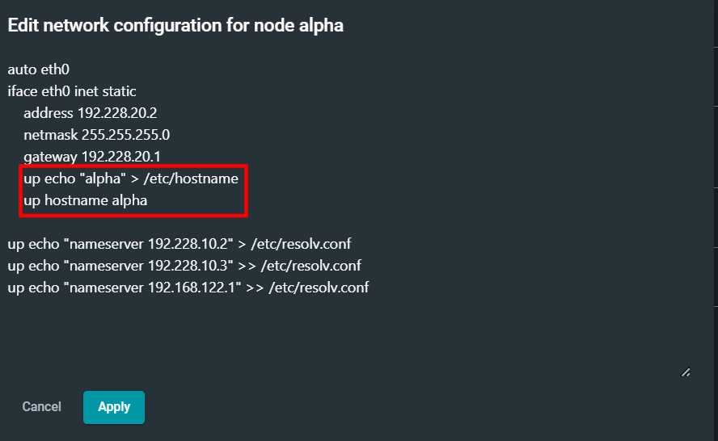
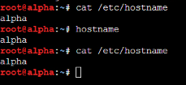

Konfigurasi DNS pada node prab kemudian diperbarui dengan menambahkan A record untuk setiap Entitas sesuai dengan hostname dan alamat IP masing-masing. Selain itu, serial pada SOA dinaikkan untuk menandai adanya perubahan pada zone file. Setelah konfigurasi selesai, dilakukan pengecekan menggunakan named-checkzone untuk memastikan sintaks dan struktur zona K34.com valid sebelum dilakukan pengujian DNS lebih lanjut.

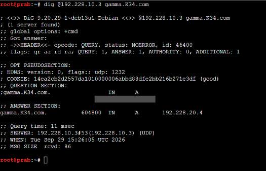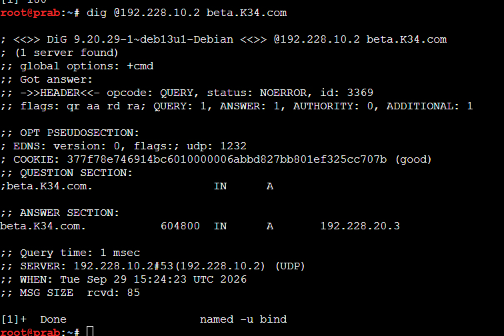

##### 6.Pastikan zone transfer berjalan, pastikan tedd telah menerima salinan zona terbaru dari prab. Nilai serial SOA di keduanya harus sama karena keduanya tidak bisa dipisahkan dan saling melengkapi.


untuk memastikannya, kita akan mengecek node tedd untuk membuktikan "apakah benar kalau tedd sudah menerima salinan zona terbaru dari prab?"
```
ls -l /var/cache/bind/ 
```
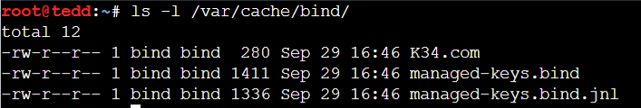
disini terbukti bahwa tedd telah menerima file K34.com

Kesamaan output pada kedua node ini, khususnya pada nilai serial number yang menunjukkan angka 1, itu bukti bahwa proses zone transfer berhasil.

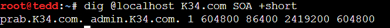

##### 7. abbey dan penny sebagai gerbang utama, obladi dan desmond sebagai web statis, oblada dan molly sebagai web dinamis. Tambahkan pada zona <xxxx>.com A record untuk vault.<xxxx>.com (IP obladi & desmond), dan core.<xxxx>.com (IP oblada & molly). Tetapkan CNAME:
* www.xxxx.com → penny.xxxx.com
* static.xxxx.com → abbey.xxxx.com
Verifikasi dari dua klien berbeda bahwa seluruh hostname tersebut ter-resolve ke tujuan yang benar dan konsisten.

disini kami membuat script setup7.sh yang berarti setup untuk no 7
script ini berfungsi untuk menambahkan A record secara otomatis ke dalam file konfigurasi zona DNS (K34.com). Penambahan ini bertujuan untuk memetakan domain vault ke IP server statis (obladi dan desmond) serta domain core ke IP server dinamis (oblada dan molly) sehingga terbentuk sistem Round Robin DNS. Selain itu, script ini juga menambahkan CNAME record untuk mengonfigurasi alias, di mana www dialihkan ke nama penny dan static dialihkan ke nama abbey. 

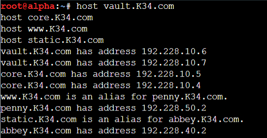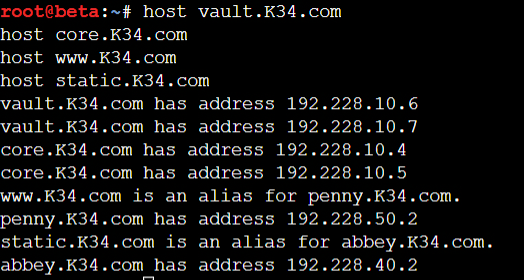

Setelah script dieksekusi dan layanan DNS di-restart, kami melakukan verifikasi pengujian DNS dari sisi klien. Berdasarkan screenshotan di atas yang dilakukan pada klien alpha dan beta, dapat dipastikan bahwa resolusi DNS telah berjalan sesuai tujuan.

1. Pemanggilan vault.K34.com dan core.K34.com berhasil memunculkan dua alamat IP secara bersamaan, membuktikan bahwa satu hostname berhasil mengenali dua server berbeda.
2. Pemanggilan [www.K34.com](https://www.K34.com) dan static.K34.com berhasil memberikan respons pengalihan (alias) ke hostname yang tepat beserta resolusi IP-nya.

```
IP_OBLADI="192.228.10.6"
IP_DESMOND="192.228.10.7"
IP_OBLADA="192.228.10.5"
IP_MOLLY="192.228.10.4"

# Pastikan path ini sesuai dengan lokasi file zone K34.com milikmu
FILE_ZONE="/etc/bind/K34.com" 

cat <<EOF >> $FILE_ZONE

; [Konfigurasi Soal Nomor 7]
vault   IN  A       $IP_OBLADI
vault   IN  A       $IP_DESMOND
core    IN  A       $IP_OBLADA
core    IN  A       $IP_MOLLY
www     IN  CNAME   penny
static  IN  CNAME   abbey
EOF

echo "Penambahan record selesai!"

```

##### 8. Di prab (master) deklarasikan reverse zone untuk segmen jaringan  tempat abbey, penny, area vault, dan area core berada. Di tedd (slave) tarik reverse zone tersebut sebagai slave, isi PTR untuk keempat hostname itu agar pencarian balik IP address mengembalikan hostname yang benar, lalu pastikan query reverse untuk alamat abbey, penny, area vault, dan area core dijawab authoritative.


di sini kita bikin kebalikan dari DNS biasanya. Kalau sebelumnya kita cari IP pakai nama domain, sekarang kita dites buat bikin Reverse DNS jadi kita cari tahu nama hostname cukup dari alamat IPnya dengan script yang kami namakan `setup8_prab.sh` dan `seteup_tedd.sh`

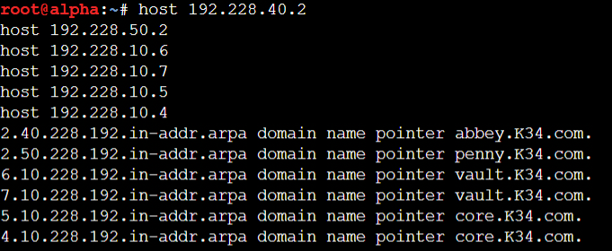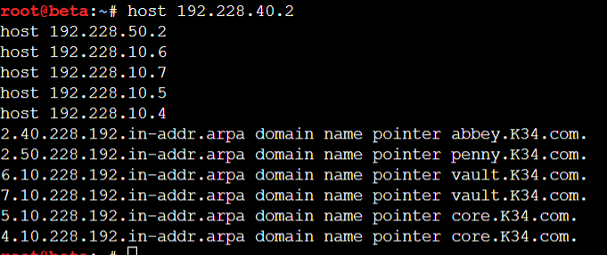

Kayak yang keliatan di SS terminal alpha sama beta di atas, pas kita coba tes pakai perintah host ke masing-masing IP (kayak 192.228.40.2 atau 192.228.10.6), hasilnya langsung keluar dengan mulus! Muncul tulisan domain name pointer yang nunjuk langsung ke abbey.K34.com, penny.K34.com, vault.K34.com, sampai core.K34.com

##### 9.Jalankan layanan web statis pada hostname di node area vault (menggunakan apache). Buka folder direktori /arsip/ dan aktifkan fitur autoindex (directory listing) pada konfigurasi Apache sehingga seluruh daftar file di dalamnya dapat ditelusuri langsung dari browser. Akses pengujian harus dilakukan melalui hostname, bukan IP address.
Jalankan layanan web dinamis (PHP-FPM) pada hostname di node


kita diminta buat nge-deploy layanan web statis pakai Apache di node area vault (yang di-handle sama si obladi dan desmond). Gak cuma sekadar nyalain web server, kita juga harus bikin direktori khusus /arsip/ dan ngaktifin fitur autoindex (directory listing). Tujuannya biar seluruh daftar file di dalam folder itu bisa keliatan dan ditelusuri langsung layaknya folder terbuka lewat browser. untuk menjalankannya kita menggunakan 

akses pengujiannya wajib pakai hostname (vault.K34.com), bukan pakai alamat IP 
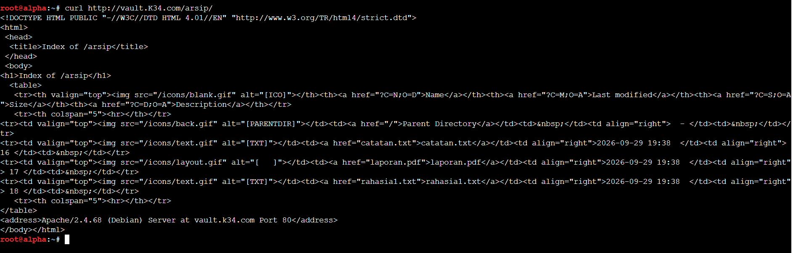
Dengan aktifnya modul autoindex (Options Indexes) pada konfigurasi virtual host/direktori Apache, klien dalam jaringan (alpha) dapat langsung menelusuri, melihat daftar file (directory listing), dan mengunduh berkas secara interaktif langsung dari browser atau terminal tanpa harus mengetahui alamat IP asli dari server 


##### 10. Jalankan layanan web dinamis (PHP-FPM) pada hostname di node core (menggunakan nginx). Buat sebuah aplikasi sederhana yang memuat halaman beranda dan halaman profil. Terapkan aturan rewrite pada server sehingga akses ke /profil dapat berfungsi dengan URL bersih (tanpa akhiran .php). Akses pengujian wajib dilakukan melalui hostname.

Kami menggunakan script otomatis setup10_nginx_core.sh untuk menginstal layanan, memastikan socket PHP berjalan, dan membuat dua halaman PHP sederhana (index.php dan profil.php).

ini kita cek dulu isi dari html di server, terdapat 2 file yaitu profil.php dan index.php, selanjutnya baru kita test apakah nginxnya bekerja dengan cara nge curl webnya

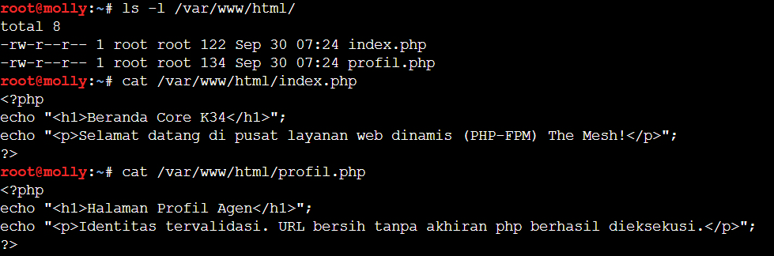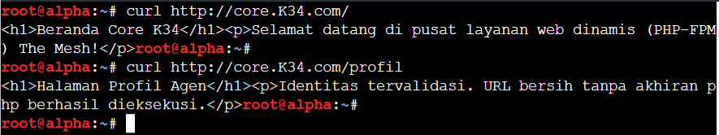

Dari hasil tes pakai klien alpha, konfigurasinya sudah running dengan banar. Waktu kita test akses http://core.K34.com/, halaman berandanya langsung muncul. Terus, pas kita coba buka http://core.K34.com/profil, Nginx berhasil munculin profil dengan bener

##### 11. Konfigurasikan Penny (menggunakan Apache) sebagai reverse proxy yang mengarah ke semua node di area vault (Obladi & Desmond). Sementara itu, konfigurasikan Abbey (menggunakan Nginx) sebagai reverse proxy menuju area core (Oblada & Molly). Pastikan kedua gerbang ini meneruskan identitas asli pengunjung ke server backend dengan melakukan forwarding header Host dan X-Real-IP. Buktikan bahwa Penny dan Abbey berhasil mendistribusikan lalu lintas dengan tepat.


Konfigurasi dilakukan menggunakan script Power[namaclient].sh pada masing-masing gateway. Script Penny berisi instalasi dan konfigurasi Apache sebagai reverse proxy menuju Obladi dan Desmond, sedangkan script Abbey/Epsilon berisi instalasi dan konfigurasi Nginx sebagai reverse proxy menuju Oblada dan Molly, termasuk forwarding header Host dan X-Real-IP.

Sebelum pengujian distribusi trafik, dilakukan verifikasi pada Penny (Apache) dan Abbey/Epsilon (Nginx) untuk memastikan konfigurasi telah valid dan kedua reverse proxy berjalan dengan baik.

**Penny**


**Abbey**
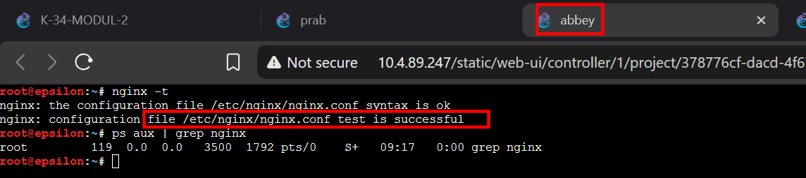

Penny
Setelah konfigurasi backend selesai dijalankan menggunakan script backupend.sh dari masing masing client, dilakukan pengujian koneksi dari Penny ke Obladi dan Desmond, kemudian pengujian melalui Penny sebagai reverse proxy untuk memastikan trafik dapat diteruskan ke kedua backend.

kemudian kita melakukan pada client dengan cmd 

```
for i in 1 2 3 4 5 6; do
    curl -s http://192.228.50.2
    echo
done

```

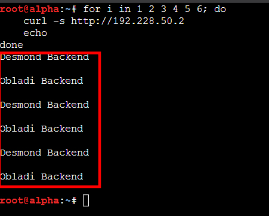

Abbey
Setelah konfigurasi Penny sebagai reverse proxy menggunakan Apache berhasil dilakukan, tahap berikutnya adalah mengonfigurasi Abbey menggunakan Nginx sebagai reverse proxy untuk area core. Konfigurasi dilakukan menggunakan script yang telah dibuat pada masing-masing node, dengan Abbey meneruskan trafik ke Oblada dan Molly, sementara kedua node tersebut dikonfigurasi sebagai backend menggunakan Apache. Dengan demikian, trafik yang masuk ke Abbey dapat diteruskan ke salah satu backend sesuai konfigurasi distribusi yang telah dibuat. *untuk script bisa dicek di folder Script*


Abbey setelah menjalankan script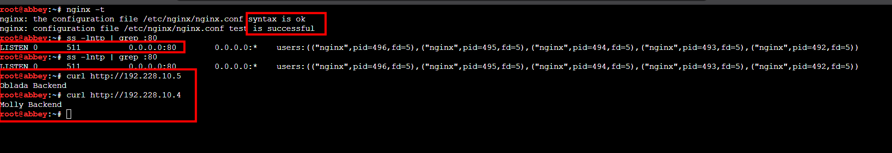
Mengecekan di client menggunakan cmd program loop pada client delta
```
for i in 1 2 3 4 5 6; do
    curl -s http://192.228.40.2
    echo
done

```


##### 12. Terdapat ruang khusus di penny yang yang menyimpan dokumen rahasia sindikat, oleh karena itu terapkan perlindungan basic authentication untuk path /admin. Akses ke jalur tersebut harus menolak pengunjung tanpa kredensial, dan hanya mengizinkan masuk jika menggunakan credential berikut:

| Username | Password                 |
| -------- | ------------------------ |
| prabs    | pakar_pinter_jadi_gob*** |


Pada tahap ini kita akan melakukan penerapan Basic Authentication pada path /admin di server Penny sebagai mekanisme perlindungan terhadap dokumen rahasia. Konfigurasi diterapkan agar akses menuju /admin tanpa kredensial ditolak, sedangkan akses dengan username prabs dan password yang telah ditentukan dapat diterima. Keberhasilan konfigurasi dibuktikan melalui pengujian akses tanpa kredensial yang menghasilkan penolakan serta pengujian menggunakan kredensial yang benar yang menghasilkan akses berhasil.

Setelah kita menjalankan script 12.sh yang sudah dibuat maka dapat dilihat kita berhasil melakukannya


##### 13. Setiap entitas dari luar harus memanggil gerbang dengan nama kanoniknya. Jika ada yang mencoba mengakses IP penny dan domain  penny.xxx.com, paksa sistem untuk melakukan redirect secara permanen (status code 301) menuju www.xxx.com. Sebaliknya, jika ada yang mengakses IP abbey dan domain abbey.xxx.com, lakukan redirect sementara (status code 302) menuju static.xxx.com.


Pada tahap ini kita akan melakukan konfigurasi redirect pada Penny dan Abbey agar akses dari entitas luar menggunakan nama kanonik yang telah ditentukan. Penny dikonfigurasi untuk memberikan redirect permanen dengan status 301 dari akses melalui IP maupun `penny.k34.com` menuju `www.K34.com`, sedangkan Abbey dikonfigurasi untuk memberikan redirect sementara dengan status 302 dari akses melalui IP maupun `abbey.k34.com` menuju `static.k34.com`. Keberhasilan konfigurasi akan dibuktikan melalui pemeriksaan status code HTTP dan nilai `Location` pada respons redirect.

Sebelum melakukan pengujian, konfigurasi DNS untuk Penny dan Abbey telah dipastikan dapat mengenali domain masing-masing. Selanjutnya, diterapkan mekanisme redirect nama kanonik, yaitu Penny mengarahkan akses melalui IP maupun penny.K34.com secara permanen dengan HTTP 301 menuju www.K34.com, sedangkan Abbey mengarahkan akses melalui IP maupun abbey.K34.com secara sementara dengan HTTP 302 menuju static.K34.com. Keberhasilan konfigurasi akan dibuktikan melalui status code dan header Location pada hasil pengujian.

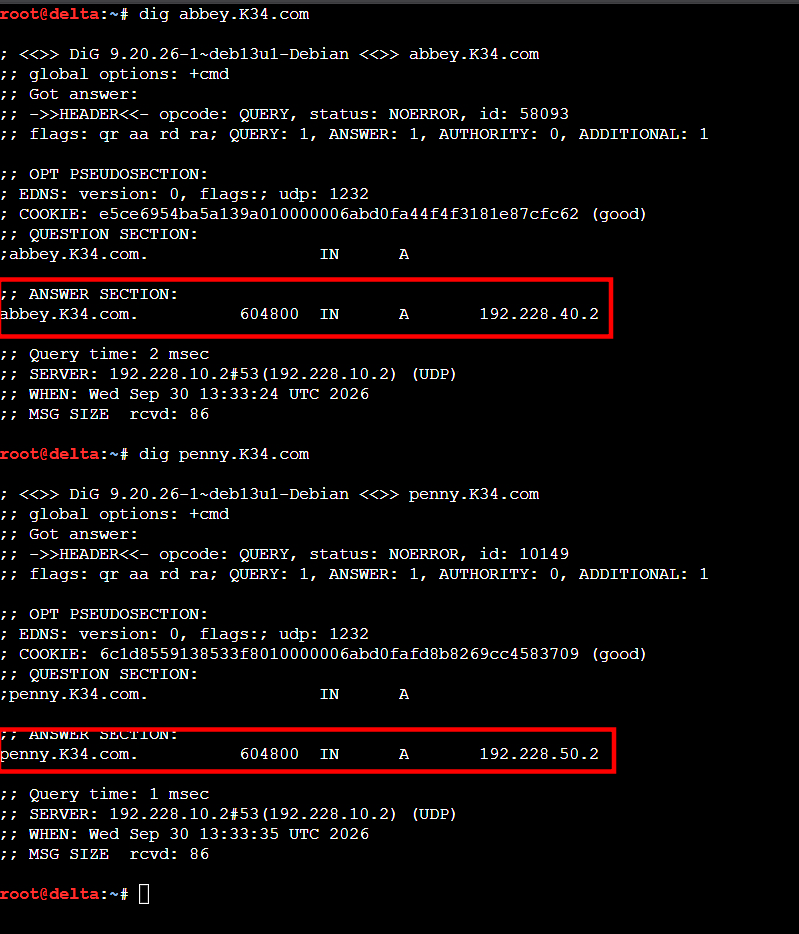
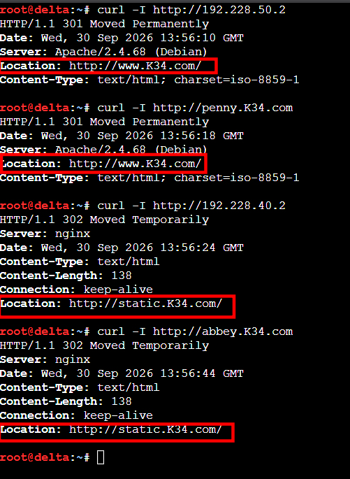

#####  14. Di dalam The Mesh, rekam jejak tidak boleh dipalsukan oleh sistem. Pastikan access log pada setiap server web di area vault maupun area core mencatat alamat IP asli milik client (pengunjung) yang diteruskan oleh gerbang, dan bukan mencatat IP dari Penny ataupun Abbey.


Obladi 
Jadi kalau ingin cek si IP listening maka kita jalanin di backup obdabila yang sudah kita set pada awal2 dengan command
```
tail -f /var/log/apache2/access.log
```
apache2/nginx tergantung si client make apa anjayyyy 
Kemudian kalau kita ingin mengecek sesuai dengan yang sudah disetup maka kita harus menambahkan variable atau command baru
```
curl -H "Host: www.K34.com" http://192.228.50.2/
```

Dia bisa masuk obladi terus karena si desmound belum kita jalankan sehingga dia masuk ke backup Obladi, sekarang kita masuk ke desmoubd

Desmond
Sekarang Desmound udah jalan, gaskan kita jalankan terlebih dahulu dengan command yang sama
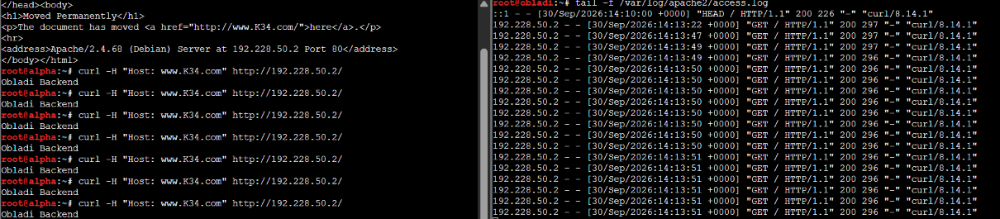

##### 15. Rootkit menginstruksikan pembuatan jalur proxy khusus yang berdiri sendiri. Pada penny buat reverse proxy untuk path /eternal yang menyajikan directory /var/www/eternal, dan pastikan path ini dapat mengeksekusi (rendering) file php. Pada abbey, buat jalur /orion yang menyajikan directory /var/www/orion, secara murni statis tanpa perlu rendering php.


Pada tahap ini, kami mengonfigurasi dua jalur proxy khusus pada gateway. Pada Penny, dibuat path `/eternal` yang mengarah ke directory `/var/www/eternal` dengan dukungan rendering PHP, sedangkan pada Abbey dibuat path `/orion` yang mengarah ke `/var/www/orion` dan hanya melayani konten statis. Dengan konfigurasi ini, masing-masing gateway memiliki jalur layanan yang terpisah sesuai fungsi yang telah ditentukan.

**Penny**
Jadi langkah pertama adalah kita harus menjalankan script `setup_eternal.sh` dan  ` proxyconf.sh` kemudian ikuti step by step berikut

1.Buat folder eternal di penny
```
mkdir -p /var/www/eternal
```
2.Masukin confignya
```
cat > /var/www/eternal/index.php <<'EOF'
<?php
echo "<h1>Eternal PHP Server</h1>";
echo "<p>PHP berhasil di-render.</p>";
echo "<p>PHP Version: " . phpversion() . "</p>";
?>
EOF

```
3.Berikan akses 
```
chown -R www-data:www-data /var/www/eternal
chmod -R 755 /var/www/eternal

```
4.Lakukan pengecekan
```
ls -l /var/www/eternal/
```
Pastikan harus ada index.php
5.Aktifkan
```
a2enmod alias
a2enmod proxy
a2enmod proxy_fcgi

```
6.Lakukan configurasi
```
cat > /etc/apache2/sites-available/reverse-proxy.conf <<'EOF'
<VirtualHost *:80> 

    ProxyPreserveHost On

    # ==========================================
    # REDIRECT KANONIK PENNY
    # ==========================================

    RewriteEngine On

    RewriteCond %{HTTP_HOST} ^192\.228\.50\.2$ [OR]
    RewriteCond %{HTTP_HOST} ^penny\.K34\.com$ [NC]
    RewriteRule ^/$ http://www.K34.com/ [R=301,L]


    # ==========================================
    # BASIC AUTH /admin
    # ==========================================

    Alias /admin /var/www/admin

    <Directory /var/www/admin>
        AuthType Basic
        AuthName "Restricted Area"
        AuthUserFile /etc/apache2/.htpasswd
        Require valid-user
    </Directory>

    ProxyPass /admin !


    # ==========================================
    # ETERNAL - PHP
    # ==========================================

    ProxyPass /eternal !

    Alias /eternal /var/www/eternal

    <Directory /var/www/eternal>
        Options FollowSymLinks
        AllowOverride None
        Require all granted
        DirectoryIndex index.php
    </Directory>

    <FilesMatch "\.php$">
        SetHandler "proxy:unix:/run/php/php8.4-fpm.sock|fcgi://localhost/"
    </FilesMatch>


    # ==========================================
    # REVERSE PROXY VAULT
    # ==========================================

    <Proxy "balancer://vault">
        BalancerMember http://192.228.10.6
        BalancerMember http://192.228.10.7
    </Proxy>

    ProxyPass        / balancer://vault/
    ProxyPassReverse / balancer://vault/


    # ==========================================
    # FORWARD CLIENT IDENTITY
    # ==========================================

    ProxyPreserveHost On
    RequestHeader set X-Real-IP "%{REMOTE_ADDR}s"

</VirtualHost>
EOF

```

7.Nyalakan dan cek2 
```
apache2ctl -S
```
```
ls -l /etc/apache2/sites-enabled/
```
```
grep -n -A20 -B5 "ETERNAL" /etc/apache2/sites-enabled/reverse-proxy.conf
```
 8.Pastikan semua berjalan baik di penny dan di client dan di sini kita ngetesnya di alpha 

Untuk di penny
```
curl -i http://127.0.0.1/eternal/
```
Akhirnya kita ngetes di client
```
curl -i http://192.228.50.2/eternal/
```
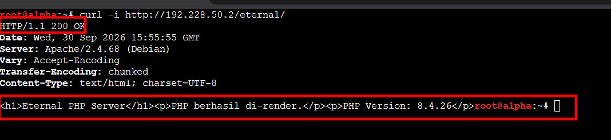

**Abbey**

Di abbey kita ngebuat Orion dan awal2 kita ngejalanin script2 yang ada di Abbey, lalu ikutin step by step berikut

1.Buat folder untuk orion
```
mkdir -p /var/www/orion
```
2.Konfigurasi dengan index html
```
cat > /var/www/orion/index.html <<'EOF'
<!DOCTYPE html>
<html>
<head>
    <title>Orion</title>
</head>
<body>
    <h1>Orion Static Server</h1>
    <p>Orion berhasil diakses secara statis.</p>
</body>
</html>
EOF
```
3.Set hirarki
```
chown -R www-data:www-data /var/www/orion
chmod -R 755 /var/www/orion

```
4.Config sites-avaiable untuk orion
```
cat > /etc/nginx/sites-available/orion <<'EOF'
server {
    listen 80;
    listen [::]:80;

    server_name 192.228.40.2 abbey.K34.com;

    location /orion/ {
        alias /var/www/orion/;
        index index.html;
    }
}
EOF

```
5.Jalankan dengan command ini
```
ln -sf /etc/nginx/sites-available/orion /etc/nginx/sites-enabled/orion
```
```
ls -l /etc/nginx/sites-enabled/
```


```
curl -i http://192.228.40.2/orion/
```
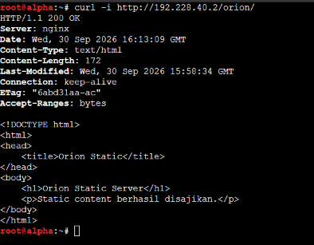

##### 16. Ketahanan gerbang The Mesh harus diuji untuk menghadapi bombardir permintaan. Salah satu Klien (misal: Alpha) bertugas melakukan stress test benchmark menggunakan ApacheBench. Lakukan 250 requests dengan tingkat konkurensi (concurrencies) 10 untuk masing - masing titik akhir: www.xxx.com dan static.xxx.com. Tampilkan rangkuman hasilnya.


Kita testnya di client ALPHA jalankan dulu scriptnya (stress.sh)
pengujian dilakukan untuk menguji ketahanan gerbang The Mesh terhadap bombardir permintaan menggunakan ApacheBench dari client Alpha. Pengujian dilakukan pada endpoint www.K34.com dan static.K34.com, masing-masing dengan 250 requests dan concurrency 10. Output yang diharapkan berupa rangkuman hasil benchmark dari kedua endpoint, seperti jumlah request berhasil/gagal, requests per second, time per request, dan transfer rate, yang kemudian didokumentasikan melalui screenshot hasil pengujian.

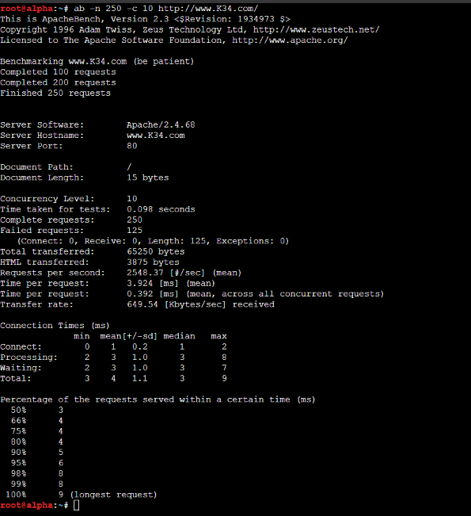


##### 17. Tambahkan TXT record pada DNS untuk semua klien sayap kiri dan sayap kanan (Alpha, Beta, Gamma, Delta, Epsilon). Jika DNS di-query TXT terhadap nama domain mereka (contoh: alpha.<xxxx>.com), sistem harus mengembalikan teks berupa nama hostname mereka masing-masing (contoh: "alpha").


buat script di prab karna node prab bertindak sebagai DNS Master yang memegang file konfigurasi zona utama untuk domain K34.com. Seluruh penambahan record DNS baru wajib dipusatkan di node ini agar nantinya dapat didistribusikan ke DNS Slave (tedd). Di sini kami menamainya `setup17_txtrecord.sh` kemudian jalankan

```
echo "Test dari client:  dig -t txt \(hostname).ZONE +short"

```

Setelah script berhasil dieksekusi di node prab, kami melakukan verifikasi dari sisi klien (misalnya klien alpha) dengan script verify17.sh

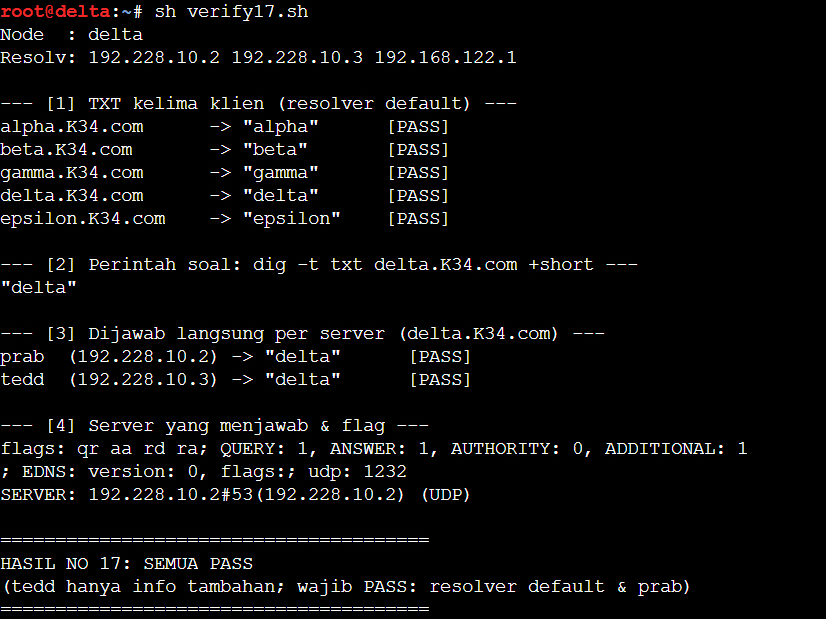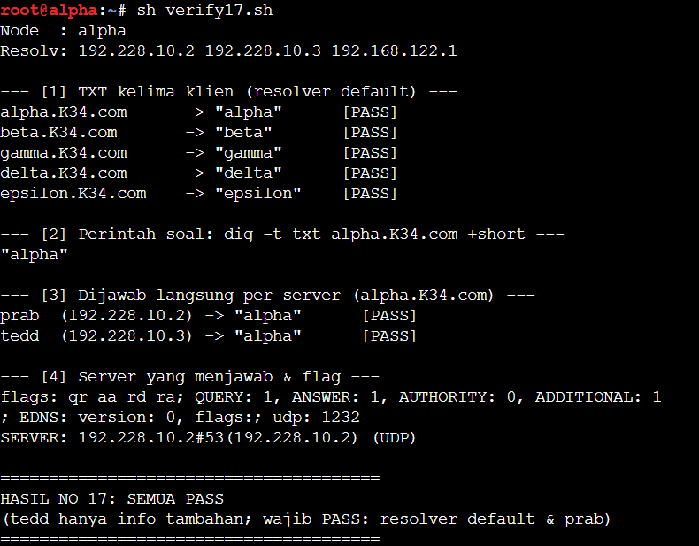

Berdasarkan hasil pengujian dari klien, query TXT ke alpha.K34.com hingga epsilon.K34.com berhasil mengembalikan teks berupa nama hostname masing-masing. Jawaban datang dari prab dengan flag aa (authoritative), dan tedd menjawab dengan hasil yang sama.

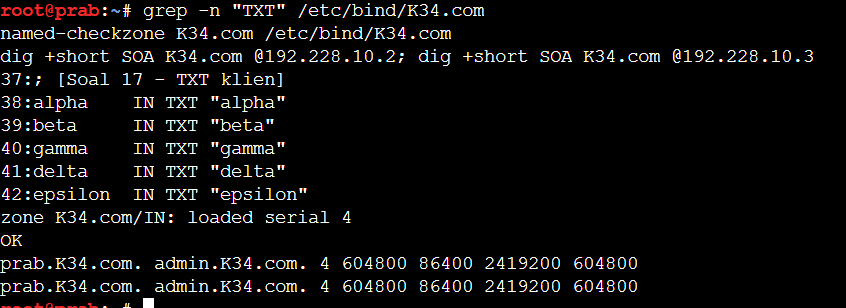

Untuk memastikan konfigurasi di sisi server berhasil, pada node prab dijalankan tiga pemeriksaan. Pertama, grep -n "TXT" /etc/bind/K34.com menunjukkan bahwa lima TXT record untuk alpha, beta, gamma, delta, dan epsilon sudah tertulis di zone file K34.com, masing-masing berisi nama hostname-nya sendiri. Kedua, named-checkzone menampilkan loaded serial 4 dan OK, yang berarti zone file valid tanpa error. Ketiga, query SOA ke prab (192.228.10.2) dan tedd (192.228.10.3) sama-sama mengembalikan serial 4, sehingga terbukti tedd sudah menerima salinan zona terbaru dari prab melalui zone transfer. 

###### 18. Ubah A record DNS milik abbey.xxx.com ke alamat IP yang fiktif (ubah secara random namun pastikan format IP valid). Naikkan nilai serial SOA di prab dan pastikan tedd ikut tersinkron. Tetapkan TTL sebesar 15 detik pada record yang relevan tersebut. Verifikasi momen yang terjadi pada tiga fase pencarian: sebelum perubahan terjadi (mengembalikan IP lama), saat perubahan baru saja terjadi dalam jeda 15 detik (masih IP lama karena cache), dan setelah batas waktu TTL habis (berubah ke IP fiktif yang baru). 


kali ini kami diminta modifikasi pada record DNS untuk domain abbey.K34.com dengan mengarahkannya ke IP fiktif (10.99.99.99) dan secara spesifik menerapkan batas waktu cache atau Time To Live (TTL) selama 15 detik. Pengujian dilakukan melalui dua tahap validasi dari sisi klien dari situ kami membuat 2 script yaitu `verify18_magic.sh` dan `setup18_fiktif.sh`

1. Fase 1 (Sebelum Perubahan): Pada kondisi awal, klien mengenali domain dengan IP aslinya, yaitu 192.228.40.2.
2. Fase 2 (Masa Tahan Cache): Setelah IP diubah menjadi IP fiktif pada DNS Master (prab), hasil query klien selama 14 detik pertama masih mengembalikan IP lama (192.228.40.2). Hal ini membuktikan bahwa klien tidak langsung menghubungi server, melainkan memanfaatkan data yang masih tersimpan di dalam cache OS-nya sesuai dengan sisa waktu TTL.
3. Fase 3 (TTL Kedaluwarsa): Memasuki detik ke-16 (setelah batas waktu TTL 15 detik terlewati), masa berlaku cache klien habis. Klien secara otomatis melakukan query ulang ke server otoritatif dan akhirnya berhasil merekam perubahan ke IP fiktif yang baru (10.99.99.99).


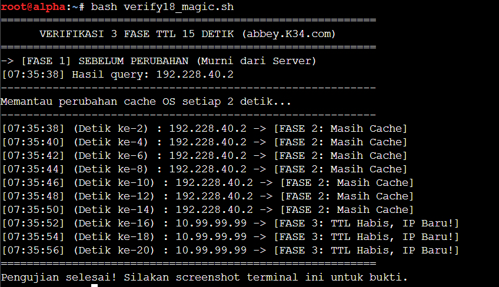

Untuk memastikan bahwa batas waktu cache juga berhasil diterapkan, eksekusi perintah dig abbey.K34.com secara lengkap dilakukan. Pada bagian ANSWER SECTION, terlihat jelas bahwa rekam DNS untuk abbey.K34.com kini memiliki nilai TTL sebesar 15 detik yang mengarah ke IP 10.99.99.99 

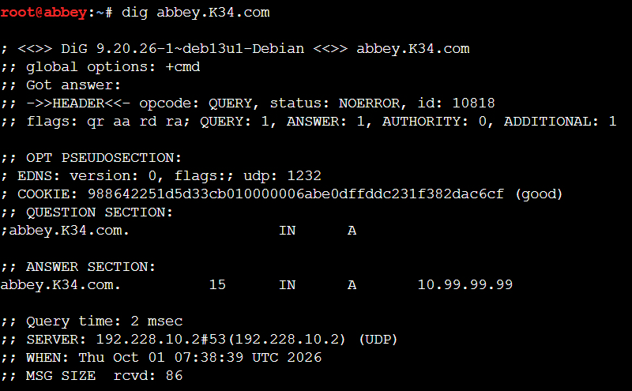

##### 19. Last? But not least? Buat CNAME record yang melakukan binding dari domain internal outbound.xxx.com menuju domain eksternal http.badssl.com, Lakukan perintah curl ke http://outbound.xxx.com dan pastikan output yang dihasilkan sesuai dengan isi konten di halaman http.badssl.com.


Di tahap ini, kita diminta untuk bikin shortcut (CNAME) dari domain internal kita (outbound.K34.com) supaya langsung nyambung ke website luar, yaitu http.badssl.com.

Caranya, kita nambahin satu baris konfigurasi di DNS Master (prab) dengan format outbound IN CNAME http.badssl.com.. Jangan lupa kasih tanda titik di paling belakang ya, biar server DNS tahu kalau itu domain internet luar, bukan domain lokal kita. di sini kami membuat script `setup19.sh` dan `verify19.sh` agar bisa berjalan dengan baik
pertama kita running dulu setupnya, jika ada yang bermasalah di tedd, running script fixtedd19.sh buat ngefix dan lanjut verify

pertama kita running dulu setupnya, jika ada yang bermasalah di tedd, running script fixtedd19.sh buat ngefix dan lanjut verify

Pada tahap ini, kami mengonfigurasi CNAME record pada DNS Master (prab) untuk mengarahkan domain internal outbound.K34.com ke domain eksternal http.badssl.com. Jika terjadi kendala sinkronisasi dengan DNS Slave (tedd) yang menyebabkan error, kami menjalankan script perbaikan otomatis fixtedd19.sh terlebih dahulu untuk membersihkan konfigurasi ganda, lalu running lagi script setup di prab 


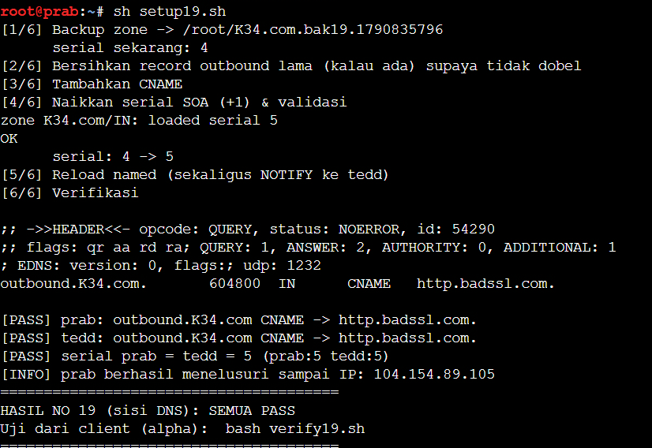

Dari hasil eksekusi script setup19.sh di DNS Master, terlihat bahwa konfigurasi CNAME berhasil ditambahkan, nomor Serial SOA otomatis naik (4 -> 5), dan proses zone transfer ke DNS Slave berjalan lancar. Hasil query menunjukkan bahwa kedua server (prab dan tedd) telah tersinkronisasi dan berhasil merespons CNAME tersebut hingga menemukan IP tujuan luar (104.154.89.105). Seluruh pengecekan di sisi server mendapatkan status [PASS]. 
setelah berhasil setup kita lanjut nge verif, apalah beneran works atau engga

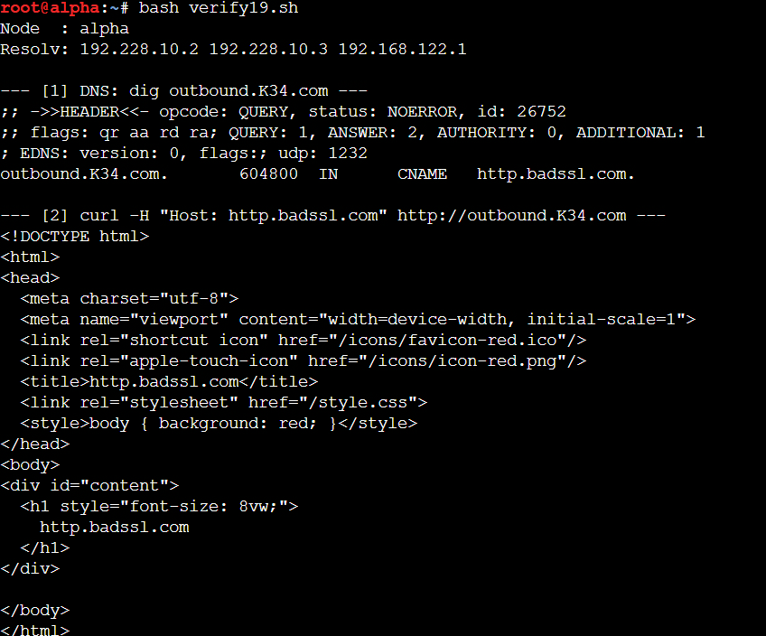


Kita mejalankan dengan sh maka akan muncul seperti ini

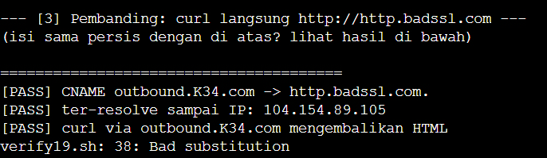

##### 20. Setelah semua penyelesaian selesai, pastikan semua service dan konfigurasi yang telah dikerjakan dari awal tetap berjalan normal dan berstatus autostart saat node di-restart (khusus untuk kasus ini, abaikan konfigurasi nomor 18 dan biarkan koordinat kembali normal).


kami membuat script `20.sh` terlebih dahulu dan menjalankannya

Penjelasan Script Server (20.sh di node prab):
* Menghapus dan Menimpa IP: Script menggunakan perintah sed untuk mencari dan menghapus baris konfigurasi IP fiktif, lalu menggunakan echo untuk menuliskan kembali IP normal abbey (192.228.40.2) ke dalam file zona DNS.
* Update Serial SOA Otomatis: Perintah perl digunakan untuk mencari angka Serial SOA di dalam file zona dan menambahkannya dengan angka 1. Ini adalah syarat mutlak dalam DNS agar server cadangan (Slave) tahu bahwa ada update data terbaru dari server Master.
* update-rc.d named defaults: Ini adalah perintah inti untuk menjawab soal "stabilitas layanan". Perintah ini mendaftarkan service BIND9 (yang bernama named) ke daftar program startup sistem operasi.
* Validasi Akhir: Script melakukan restart service dan menjalankan dig lokal yang membuktikan bahwa IP sudah sukses kembali ke 192.228.40.2.

Penjelasan Script Klien (verify20.sh di node alpha), script ini bertugas membuktikan bahwa klien bisa menggunakan jaringan dengan lancar:
* dig outbound.K34.com: Memeriksa apakah klien bisa menanyakan rute domain eksternal ke server DNS. Hasilnya membuktikan outbound.K34.com sukses diterjemahkan (melalui record CNAME) menjadi http.badssl.com beserta rute IP aslinya.
* curl -I ...: Melakukan pengujian koneksi web (meminta HTTP Header) ke alamat tersebut. Munculnya balasan HTTP/1.1 200 OK membuktikan bahwa klien tidak hanya sukses menerjemahkan nama domain, tetapi juga berhasil menembus koneksi internet untuk mengakses website tujuan tanpa error.


beberapa hal yang akan dilakukan pada no 20
1. ormalisasi Jaringan: Mengembalikan pengaturan IP abbey yang sempat diubah menjadi IP fiktif (pada tugas 18) kembali ke alamat IP aslinya agar seluruh rute jaringan normal kembali.
2. Stabilitas Layanan (Autostart): Memastikan aplikasi DNS server (BIND9) didaftarkan ke sistem operasi agar otomatis menyala (autostart) setiap kali mesin server menyala atau di-restart.
3. Verifikasi Akhir: Memastikan dari sisi klien bahwa terjemahan DNS untuk rute website luar (eksternal) dan koneksi jaringannya tetap berjalan sempurna setelah dikembalikan ke kondisi normal.
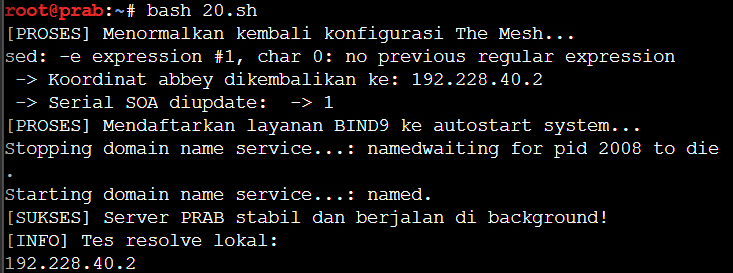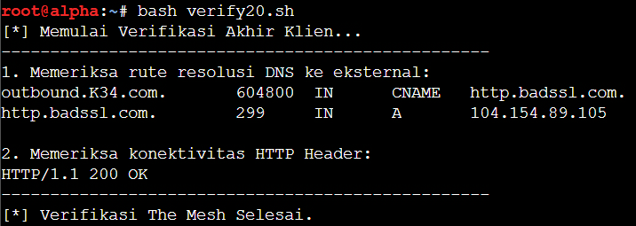

Dari hasil eksekusi di atas, ini beberapa kesimpulan:
1. Pada node prab, konfigurasi IP abbey telah kembali normal menjadi 192.228.40.2 beserta pembaruan otomatis pada Serial SOA. Layanan DNS (BIND9) juga sukses didaftarkan ke autostart sistem agar selalu berjalan stabil.
2. Pengujian dari node alpha membuktikan resolusi CNAME eksternal untuk outbound.K34.com berjalan lancar. Konektivitas juga terbukti normal sepenuhnya dengan respons akses web HTTP/1.1 200 OK.
